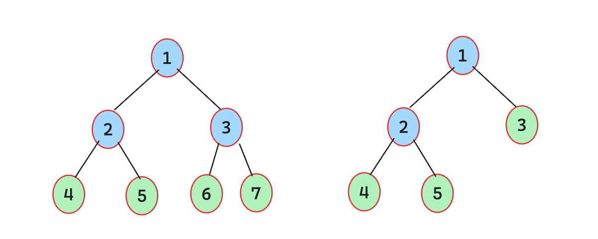
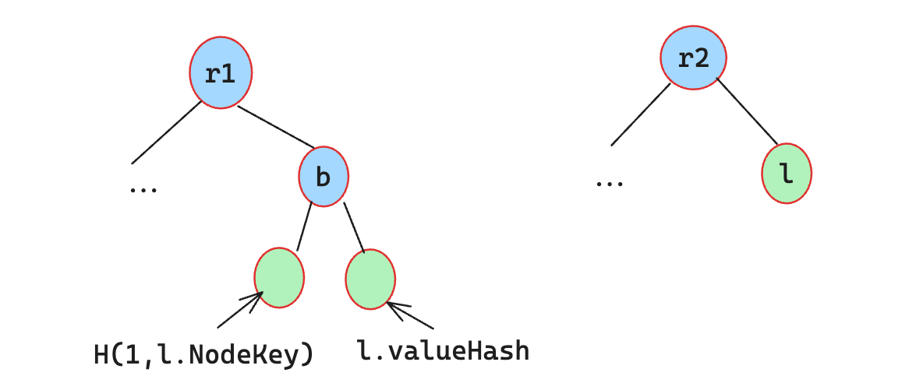

# Lack of Domain Separation

## Introduction

In cryptography, domain separation involves using distinct prefixes, labels, or keys in different contexts or for different purposes, ensuring that even if the same cryptographic algorithm and inputs are used, outputs will differ.

Without proper domain separation, systems become vulnerable to various attacks. Attackers can produce unexpected valid values which will be accepted in multiple contexts.

The most common example is a Merkle tree, where leaf hashes and internal node hashes must not be interchangeable.

## Cases

### 1. Scroll zkTrie: Lack of domain separation allows proof forgery

| Identifier | Severity | Location | Status |
| :--------: | :------: | :------: | :----: |
| Trail of Bits | High | [trie/zk_trie_node.go](https://github.com/scroll-tech/zktrie/blob/90179c19281670f41c54bd80ab01e4d64c860521/trie/zk_trie_node.go#L118-L156) | Fixed |

#### Description

Merkle trees are nested tree data structures in which the hash of each branch node depends upon the hashes of its children. The hash of each node is then assumed to uniquely represent the subtree rooted at that node. However, that assumption may be false if a leaf node can have the same hash as a branch node.

<div align=center></div>

A general method for preventing leaf and branch nodes from colliding in this way is domain separation. That is, given a hash function $H$, define the hash of a leaf to be $H(f(leaf_data))$ and the hash of a branch to be $H(g(branch_data))$, where $f$ and $g$ are encoding functions that can never return the same result (perhaps because $f$’s return values all start with the byte 0 and $g$’s all start with the byte 1). Without domain separation, a malicious entity may be able to insert a leaf into the tree that can be later used as a branch in a Merkle path.

In zkTrie, the hash for a node is defined by the [NodeHash](https://github.com/scroll-tech/zktrie/blob/90179c19281670f41c54bd80ab01e4d64c860521/trie/zk_trie_node.go#L118C1-L156C2) method. If `n.nodeHash` does not exist, the function calculates it according to the node type. If it is a `NodeTypeParent`, the node hash is computed as:
```go
n.nodeHash, err = zkt.HashElems(n.ChildL.BigInt(), n.ChildR.BigInt())
```
If it is a `NodeTypeLeaf`, the node hash is computed as:

```go
n.valueHash = zkt.PreHandlingElems(n.CompressedFlags, n.ValuePreimage)

n.nodeHash = LeafHash(n.NodeKey, n.valueHash)
```

The `HashElems` and `PreHandlingElems` methods are defined [here](https://github.com/scroll-tech/zktrie/blob/90179c19281670f41c54bd80ab01e4d64c860521/types/util.go). `HashElems` recursively applies Poseidon over field elements, reducing two fields into one at each step. `PreHandlingElems` converts a bytes32 array into field elements before invoking the hash.

Therefore, the `nodeHash` of a branch node is `H(n.ChildL.BigInt(), n.ChildR.BigInt())`, while the `nodeHash` of a leaf node is `H(H(1, n.NodeKey), n.valueHash)`. Without a clear domain boundary between these two formats, attackers may construct different tree semantics with the same root.

<div align=center></div>

#### The Fix


