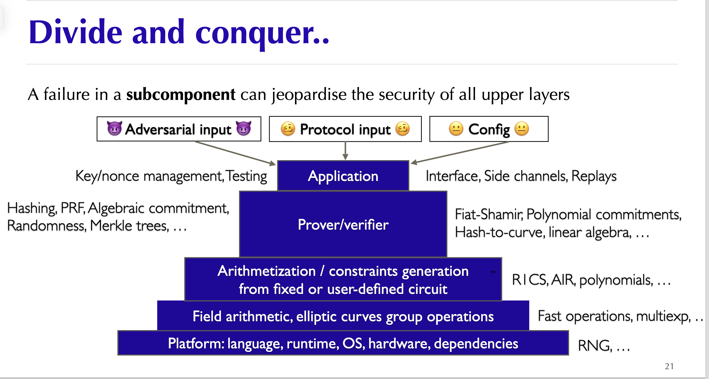

# Awesome zero knowledge proofs security
 A curated list of awesome things related to learning zero knowledge proofs security

## Table of Content
- [Table of Content](#table-of-content)
- [1. Introduction](#1-introduction)
- [2. Vulnerability Classification](#2-vulnerability-classification)
  - [Architectural Design Flaws](#architectural-design-flaws)
  - [FrontEnd: Circuits](#frontend-circuits)
    - [Soundness Error (Under-constrained)](#soundness-error-under-constrained)
    - [Completeness Error (Over-constrained)](#completeness-error-over-constrained)
    - [Zero Knowledge Error](#zero-knowledge-error)
  - [Misc: Witness Generation \& Arithmetization](#misc-witness-generation--arithmetization)
  - [BackEnd: Proving system](#backend-proving-system)
- [3. Security Consideration](#3-security-consideration)
  - [circom](#circom)
  - [cairo](#cairo)
- [4. Learning Resources](#4-learning-resources)
  - [Books \& Docs](#books--docs)
  - [Papers](#papers)
  - [Blogs](#blogs)
    - [Highlights](#highlights)
    - [Resources](#resources)
  - [Videos \& Podcast](#videos--podcast)
  - [Audit Reports](#audit-reports)
  - [Tools](#tools)
  - [zkHACK/CTF/Puzzles](#zkhackctfpuzzles)
  - [Lectures](#lectures)
  - [Miscellaneous](#miscellaneous)
- [Acknowledgements](#acknowledgements)

## 1. Introduction

[Zero Knowledge Proof (ZKP)](https://github.com/matter-labs/awesome-zero-knowledge-proofs) technology is considered a promising infrastructure for blockchain and many broader privacy-preserving systems.

Conceptually, proving systems are advanced cryptographic protocols. In practical ZK applications, however, security review usually separates the system into a front-end and a back-end.

In general, ZKP is a technique for proving correct program execution while preserving completeness, soundness, and zero knowledge. The front-end is the provable program, usually circuits or circuit-like constraints that encode computation logic. The back-end is the proving system that generates and verifies proofs for that logic.

As in other engineering domains, many practical ZK failures come from implementation bugs and incorrect integration assumptions.

This repository uses a zk application perspective. The following figure from [Aumasson's slides](https://www.aumasson.jp/data/talks/zksec_zk7.pdf) provides a useful layered model.

Circuit implementations have their own vulnerability classes, which are distinct from low-level cryptographic bugs in proving systems.

## 2. Vulnerability Classification

The mental model of circuits is different from traditional programming. A value appearing in witness generation code is not necessarily constrained by the proof.

The programming model of zkVM applications is closer to traditional programming, but the underlying VM is still implemented as constraints. Only circuit-friendly operations, such as [Pedersen](https://iden3-docs.readthedocs.io/en/latest/iden3_repos/research/publications/zkproof-standards-workshop-2/pedersen-hash/pedersen.html#pdf-link), [Poseidon](https://eprint.iacr.org/2019/458.pdf), and [MiMC](https://eprint.iacr.org/2016/492.pdf), are cheap to prove. **The underlying execution model of zkVMs is still circuit-based**.

The emergence of zkVMs, including zkEVMs, has expanded ZK applications to smart contracts, rollups, and general programs, such as [Starknet](https://github.com/lambdaclass/cairo-vm), [Polygon zkEVM](https://docs.polygon.technology/zkEVM/), [Scroll](https://scroll.io/blog/zkevm), [zkSync](https://github.com/matter-labs/zksync-era), [RISC Zero](https://dev.risczero.com/api/zkvm/), and [SP1](https://github.com/succinctlabs/sp1).

It also overlaps with traditional security fields such as reverse engineering, as shown by this CTF [puzzle](https://github.com/weikengchen/zkctf-r0-season1) by [weikeng chen](https://github.com/weikengchen/).

Therefore, programs above zkVMs have a broader security scope, including smart contracts and traditional application logic. This repository focuses mainly on ZK-specific security issues.

### Architectural Design Flaws

- [Front Running](./Architectural%20Design%20Flaws/Front-Running.md)

### FrontEnd: Circuits

#### Soundness Error (Under-constrained)

Missing constraints are the most common class of circuit bug. They occur when a circuit **fails to enforce necessary conditions** on inputs, witness values, intermediate computations, or protocol state. As a result, a prover may satisfy the constraints while proving a statement that is false under the intended specification.

This repository groups soundness errors into the following subcategories:

- [General Logic](./Circuits%20Bugs/Soundness/General%20Logic%20Bug.md)
- [Arithmetic Over/Under Flow](./Circuits%20Bugs/Soundness/Arithmetic%20Over%20or%20Under%20Flow.md)
- [Mismatched Types/Lengths](./Circuits%20Bugs/Soundness/Mismatched%20Type%20or%20Length.md)
- [Non-determinism](./Circuits%20Bugs/Soundness/Non-determinism.md)
- [Assigned but not Constrained](./Circuits%20Bugs/Soundness/Assigned%20but%20not%20constrained.md)
- [Cryptographic Primitive Misuse](./Circuits%20Bugs/Soundness/Cryptographic%20Primitive%20Misuse.md)
- [Compiler Optimization](./Circuits%20Bugs/Soundness/Compiler%20Optimization.md)
- [Trusted Setup Error](./Circuits%20Bugs/Soundness/Trusted%20Setup%20Error.md)

#### Completeness Error (Over-constrained)

- [Over-constrained Circuits](./Circuits%20Bugs/Completeness/Over-constrained%20Circuits.md)
  
#### Zero Knowledge Error

- [Bad Protocol Design/Implementation](./Circuits%20Bugs/Zero-Knowledge/Bad%20Protocol%20Design%5CImpl.md)

### Misc: Witness Generation & Arithmetization

Worth further exploring.

### BackEnd: Proving system

The backend is the proving system and is closer to the cryptographic layer. One must note: **even secure primitives may introduce vulnerabilities if used incorrectly in the larger protocol or configured in an insecure manner**. 

To sum up, many proving-system vulnerabilities come from **unstandardized cryptographic implementation**.

- [Bad Polynomial Implementation](./Proving%20System%20Bugs/Bad%20Polynomial%20Impl.md)
- [Frozen Heart](./Proving%20System%20Bugs/Frozen%20Heart.md)
- [Lack of Domain Separation](./Proving%20System%20Bugs/Lack%20of%20Domain%20Seperation.md)
- [Missing Curve Point check](./Proving%20System%20Bugs/Missing%20Curve%20Point%20Check.md)
- [Insecure Hash Function](./Proving%20System%20Bugs/Unsecure%20Hash%20Function.md)

## 3. Security Consideration

### circom

- [blockdev's slides](https://hackmd.io/@blockdev/Bk_-jRkXa#/)
- [Best Practices for Large Circom Circuits](https://hackmd.io/V-7Aal05Tiy-ozmzTGBYPA?view)

For practical review, use [check_list.md](./check_list.md) together with the [Circuit Bugs](./Circuits%20Bugs/README.md) taxonomy. Circom-specific review should focus on constraint completeness, public input binding, witness assignment, compiler behavior, and cryptographic primitive integration.

### cairo

1. No payable functions
2. Name hashed storage slots
3. Upgradeability built-in
4. Separated internal/external functions
5. Cheap execution means readable algorithms
6. Immutable variables by default
7. Safe type conversions
8. Option and Result traits

**Reference**
- [starknet book](https://book.starknet.io/ch02-14-security-considerations.html)
- [cairo-the-starknet-way-to-writing-safe-code by Nethermind Security](https://medium.com/nethermind-eth/cairo-the-starknet-way-to-writing-safe-code-8169486c7132)

## 4. Learning Resources

### Books & Docs

- [Proofs, Arguments, and Zero-Knowledge (PAZK)](https://people.cs.georgetown.edu/jthaler/ProofsArgsAndZK.pdf) by Thaler.
- [Hash-based SNARGs-Book](https://github.com/hash-based-snargs-book/hash-based-snargs-book/blob/main/snargs-book.pdf) by Alessandro Chiesa and Eylon Yogev.
- [ZKDocs](https://www.zkdocs.com/) by [Trail of Bits](https://www.trailofbits.com/)
- [The RareSkills Book of Zero Knowledge](https://www.rareskills.io/zk-book) Not fully disclosed :(.
- [Pairings for beginners](https://static1.squarespace.com/static/5fdbb09f31d71c1227082339/t/5ff394720493bd28278889c6/1609798774687/PairingsForBeginners.pdf) by Craig Costello.
- [ZKPunk](https://www.zkpunk.pro/): A content platform centered around Zero-Knowledge Proof (ZKP) technology, dedicated to promoting its adoption and development

### Papers

- [SoK: What Don’t We Know? Understanding Security Vulnerabilities in SNARKs](https://arxiv.org/pdf/2402.15293)
- [CirC: Compiler infrastructure for proof systems, software verification, and more](https://github.com/circify/circ/)
- [Weak Fiat-Shamir Attacks on Modern Proof Systems](https://eprint.iacr.org/2023/691.pdf)
- [On the practical CPAD security of “exact” and threshold FHE schemes and libraries](https://eprint.iacr.org/2024/116)
- [Automated Analysis of Halo2 Circuits](https://ceur-ws.org/Vol-3429/paper3.pdf)

### Blogs

#### Highlights

- [Endeavors into the zero-knowledge Halo2 proving system](https://consensys.io/diligence/blog/2023/07/endeavors-into-the-zero-knowledge-halo2-proving-system/#:~:text=How%20can%20bugs%20happen%20in%20Halo2%20circuits%3F) by Consensys Diligence
- [Frozen Heart](https://blog.trailofbits.com/2022/04/13/part-1-coordinated-disclosure-of-vulnerabilities-affecting-girault-bulletproofs-and-plonk/) by Trail of bits.
- [Two Vulnerabilities in gnark's Groth16 Proofs](https://www.zellic.io/blog/gnark-bug-groth16-commitments/) by Zellic.

#### Resources

- [Trial of Bit Cryptography Blog](https://tlu.tarilabs.com/cryptography/)
- [0xPARC Blog](https://0xparc.org/blog)
- [zkHACK Blog](https://zkhack.dev/blog/)
- [NCC Group Research Blog](https://research.nccgroup.com/)
- [Zellic Blog](https://www.zellic.io/blog/)
- [zkSecurity Blog](https://www.zksecurity.xyz/blog/)
- [Rot256 Blog](https://rot256.dev/)
- [David Wong Blog](https://www.cryptologie.net/)
- [LambdaClass Blog](https://blog.lambdaclass.com/)
- [Nethermind Blog](https://www.nethermind.io/blogs)
- [Ingonyama Blog](https://www.ingonyama.com/blog)
- [Open Zeppelin Blog](https://blog.openzeppelin.com/)
- [Vitalik Blog](https://vitalik.eth.limo/)
- [samczsum Blog](https://samczsun.com/)
- [Tim Blog](https://timimm.github.io/zk-writeups/)

### Videos & Podcast
- [Zero Knowledge Youtube](https://www.youtube.com/@zeroknowledgefm) by Zero Knowledge.
- [Zero Knowledge Podcast](https://www.youtube.com/playlist?list=PLj80z0cJm8QEUVSlofe1Zd7wyaoZrixFM) by Zero Knowledge.
- [ZK Whiteboard Sessions](https://zkhack.dev/whiteboard/) by ZK Hack.
- [ZK Submit](https://www.youtube.com/playlist?list=PLj80z0cJm8QFnY6VLVa84nr-21DNvjWH7) by Zero Knowledge.
- [ZK Study Club](https://www.youtube.com/playlist?list=PLj80z0cJm8QHm_9BdZ1BqcGbgE-BEn-3Y) by Zero Knowledge.
- [ZKP Mooc](https://zk-learning.org/) by Dan Boneh, Shafi Goldwasser, Dawn Song, Justin Thaler, Yupeng Zhang. 
- [Thaler Book Study Club](https://www.youtube.com/playlist?list=PLj80z0cJm8QEmZkGgSOLpr_8B08SCWVQ7) by Thaler.
- [A16Z Summer Research Seminars](https://www.youtube.com/playlist?list=PLjQ9HCQMu_8yPGgfvsscHgt1w1KJkx8BN) by A16Z Crypto.
- [Introduction to ZK Security Research](https://www.youtube.com/watch?v=P2OVtcsSZSQ)  by David Theodore from EF. This classification of bugs in zk-circuits is widely accepted.
- [zBlock1](https://yacademy.dev/fellowships/zBlock1) by yAcademy. 
- [Moon Math Club](https://www.youtube.com/playlist?list=PLormosL00ryKvlKvMgezcSBtANAhqkm44) by Ingonyama
- [The PLONK zero knoledge proof system](https://www.youtube.com/playlist?list=PLBJMt6zV1c7Gh9Utg-Vng2V6EYVidTFCC) by David Wong.
- [Foundations of Probabilistic Proofs](https://www.youtube.com/playlist?list=PLGkwtcB-DfpzST-medFVvrKhinZisfluC) by Alessandro Chiesa.
- [Probabilistically Checkable Proofs and Interactive Proofs](https://www.youtube.com/playlist?list=PLkFD6_40KJIyWWtxCPBHwGsrutjvwM5_U)
- [Zero-knowledge proof composition and incursion](https://www.youtube.com/playlist?list=PLBJMt6zV1c7GeKkR2SUhzx9KSJ9TsEx6n) by David Wong.
- [An introduction to the Arithmetic of Elliptic Curve](https://www.youtube.com/playlist?list=PLYpVTXjEi1oe1OeAllJpNhFoI4B7Ws8Yl) by Alvaro Lozano-Robledo.

### Audit Reports

- [ZK Related Security Reviews](https://github.com/nullity00/zk-security-reviews) of ZK Protocols by [nullity](https://github.com/nullity00). Consists of Security Reports of 50+ ZK Protocols.
- [code4rena Report](https://code4rena.com/reports)

You can directly visit the [solodit](https://solodit.xyz/) website to get some off-the-shelf audit reports.

If you are intereted in security about zkVM programs, here are some audit material about smart contract.

Solidity: 
  - [Solidity Security Blog](https://github.com/sigp/solidity-security-blog)
  - [not-so-smart-contract](https://github.com/crytic/not-so-smart-contracts)
  - [List of Security Vunerabilities](https://github.com/runtimeverification/verified-smart-contracts/wiki/List-of-Security-Vulnerabilities)

Cairo: 
  - [Opus-2024_01-c4](https://code4rena.com/reports/2024-01-opus#h-01-neglect-of-exceptional-redistribution-amounts-in-withdraw_helper-function)
  - [lindy-labs-aura-2023_11-tob](https://solodit.xyz/issues/healthy-loans-can-be-liquidated-trailofbits-none-lindy-labs-aura-pdf)
  - [Argent-Account-2023_6-consensys](https://consensys.io/diligence/audits/2023/06/argent-account-multisig-for-starknet/)

### Tools
| Tool | Technique | UC	| OC | CE |
| - | - | - | - | - | 
| Circomspect | SA | ✓ | ✗ | ✗ |
| ZKAP | SA	| ✓	| ✗	| ✗ |
| halo2-analyzer | SA | ✓	| ✓ |	✗ |
| Coda | FV	| ✓	| ✓	| ✓ |
| Ecne | FV | ✓ |	✗ | ✗ |
| Picus | FV | ✓ | ✗ | ✗ |
| Aleo | FV | ✓ | ✓ | ✓ |
| SnarkProbe | DA | ✓ |	✓	| ✗ |
| CIVER|FV|✓|✗|✗ |
| GNARK/Lean | FV | ✓ | ✓	| ✓ |

### zkHACK/CTF/Puzzles

- [zkHACKs](https://zkhack.dev/)
- [Paradigm CTF](https://ctf.paradigm.xyz/)
- [Paradigm CTF Infrastructure](https://github.com/paradigmxyz/paradigm-ctf-infrastructure)
- [Open Zeppelin CTF](https://ctf.openzeppelin.com/)
- [Ingonyama CTF](https://ctf.ingonyama.com/)
- [RareSkill ZK Puzzles](https://github.com/RareSkills/zero-knowledge-puzzles/tree/main)
- [cairo-damn-vulnerable](https://github.com/credence0x/cairo-damn-vulnerable-defi)
- [starknet-security-challenges.app](https://starknet-security-challenges.app/)
- [StarknetCC-CTF](https://github.com/pscott/StarknetCC-CTF)

writeups

- [Secureum bootcamp/race writeup](https://ventral.digital/secureum-auditor-bootcamp-2021-quizzes/)
- [2023 Ingonyama CTF WP by shuklaayush](https://hackmd.io/@shuklaayush/SkWizdyBh)
- [2023 Ingonyama CTF Official WP](https://github.com/ingonyama-zk/zkctf-2023-writeups)

### Lectures

[Algebraic Error Correcting Codes](https://web.stanford.edu/~marykw/classes/CS250_W18/index.html)

### Miscellaneous

- ["Security of ZKP projects: same but different"](https://www.aumasson.jp/data/talks/zksec_zk7.pdf) by JP Aumasson @ [Taurus](https://www.taurushq.com/). Great slides outlining the different types of zk security vulnerabilities along with examples.
- [0xPARC zk-bug-tracker](https://github.com/0xPARC/zk-bug-tracker) by [0xPARC](https://0xparc.org/) and [PSE](https://pse.dev/).
- BUG bounty platform: [code4rena](https://code4rena.com/), [Immunefi](https://immunefi.com/).
- [l2-security-framework by QuantStamp](https://github.com/quantstamp/l2-security-framework)
- [MyZKP: Building Zero Knowledge Proof from Scratch in Rust](https://koukyosyumei.github.io/MyZKP/index.html)
- [ZKP vulns dataset](https://docs.google.com/spreadsheets/d/1E97ulMufitGSKo_Dy09KYGv-aBcLPXtlN5QUpwyv66A/edit?gid=0#gid=0).

## Acknowledgements

Special thanks go to the following individuals and organizations for their ongoing support and encouragement: [Nullity](https://nullity00.github.io/).
